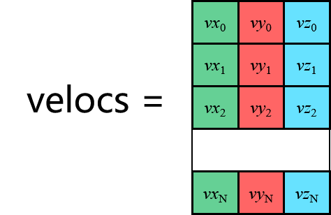

# Collision-simulation-in-2D-rectangles
&emsp;&emsp;并行计算方法，张量编程和OPP编程的对比。  
&emsp;&emsp;还应该继续提升碰撞后的反应，当粒子数变多以后似乎能量不守恒，速率分布奇怪。还没有完成模块化改造，有时间再修改吧，已经能跑了！

## 碰撞检测  

  
&emsp;&emsp;多个粒子的状态需要每一帧更新，这样的动态变化非常适合并行计算。粒子的动力学量为 $\left[ \vec{r}, \vec{v}, \vec{a} \right]$ ，多粒子系统非常适合写成张量数据结构用```pytorch```的算子加速并行计算。   

&emsp;&emsp;本次模拟是不考虑重力的弹性碰撞，核心数据就是坐标张量```coords```与速度张量```velocs```   
    
    

&emsp;&emsp;最费算力的地方在于粒子间的碰撞检测，这里用组合数来检测距离的方法```torch.combinations()```。[计算机图形学](https://www.youtube.com/watch?v=eED4bSkYCB8)和分子动力学中有许多更高效的碰撞检测方法，这里就不去实现了，就用暴力方法吧，待改进。  

## 运动改变  

**问题一：帧间隔太慢**   
&emsp;&emsp;在碰撞检测成功以后，我们虽然更新了速度矢量，但是会出现新bug，由于粒子有体积，因此会出现小球还没分开，但是下一次碰撞检测又被检测出来的情况，此时两个碰撞的粒子会不断纠缠在一起。   
**问题二：帧间隔太快**  
&emsp;&emsp;如果在一次计算间隔中，小球前进距离大于 $r_1+r_2$ 那就会发生穿透。  


## 玻尔兹曼分布   

&emsp;&emsp;可以利用演化结果验证[2D麦克斯韦-玻尔兹曼速率分布](https://en.wikipedia.org/wiki/Maxwell%E2%80%93Boltzmann_distribution#Relation_to_the_2D_Maxwell%E2%80%93Boltzmann_distribution)，即 $\mathbb{P}(u<|\vec{v}|<u+du)=pdf(u)=\frac{mu}{kT}\exp{\left(\frac{-mu^2}{2kT}\right)}$ 。在 $u\isin [1,+\inf)$ 域内积分是归一化的。

## 动图  
&emsp;&emsp;```ax.hist()```直方图用```update```方法画动图有问题，不能和其它元素```ax.text()```一起刷新