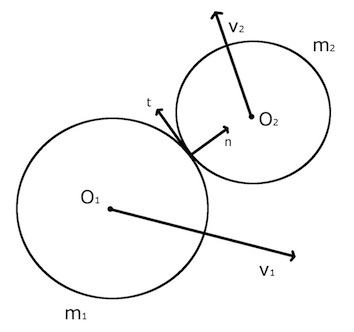

# Collision-simulation-in-2D-rectangles
并行计算方法，张量编程和OPP编程的对比

## 碰撞检测  
  

## 运动改变
**问题一：帧间隔太慢**   
&emsp;&emsp;在碰撞检测成功以后，我们虽然更新了速度矢量，但是会出现新bug，由于粒子有体积，因此会出现小球还没分开，但是下一次碰撞检测又被检测出来的情况，此时两个碰撞的粒子会不断纠缠在一起。   
**问题二：帧间隔太快**  
&emsp;&emsp;如果在一次计算间隔中，小球前进距离大于 $r_1+r_2$ 那就会发生穿透。  


## 玻尔兹曼分布  
&emsp;&emsp;可以利用演化结果验证[2D麦克斯韦-玻尔兹曼速率分布](https://en.wikipedia.org/wiki/Maxwell%E2%80%93Boltzmann_distribution#Relation_to_the_2D_Maxwell%E2%80%93Boltzmann_distribution)    
$$
\mathbb{P}(u<|\vec{v}|<u+du)=pdf(u)=\frac{mu}{kT}\exp{\left(\frac{-mu^2}{2kT}\right)}
$$
在$u\isin[1,+\inf)$域内积分是归一化的。

## 动图  
&emsp;&emsp;```ax.hist()```直方图用```update```方法画动图有问题，不能和其它元素```ax.text()```一起刷新